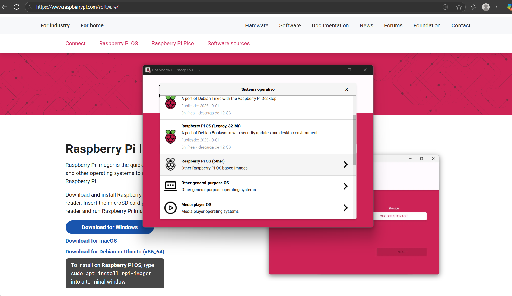
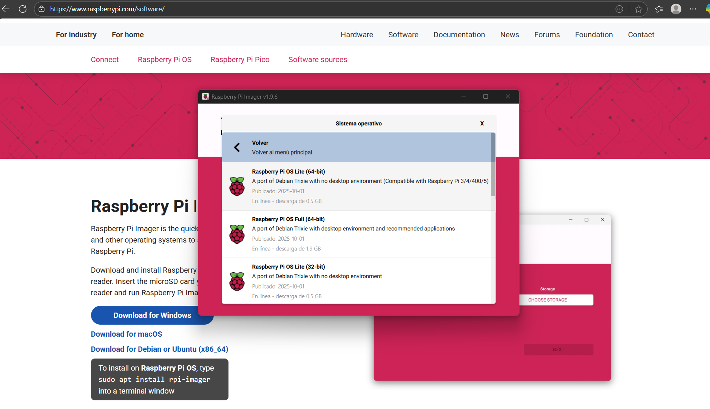
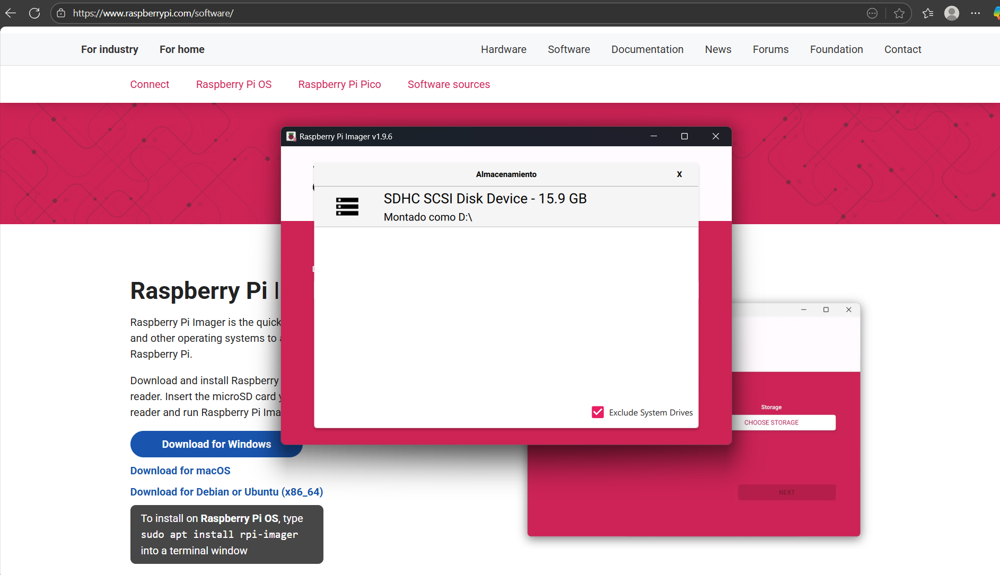
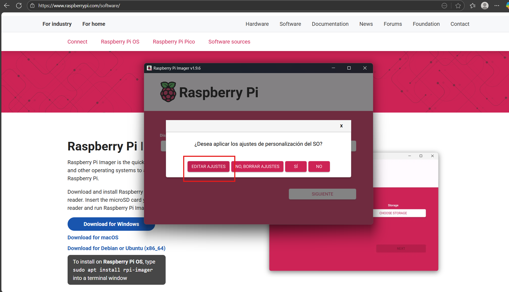
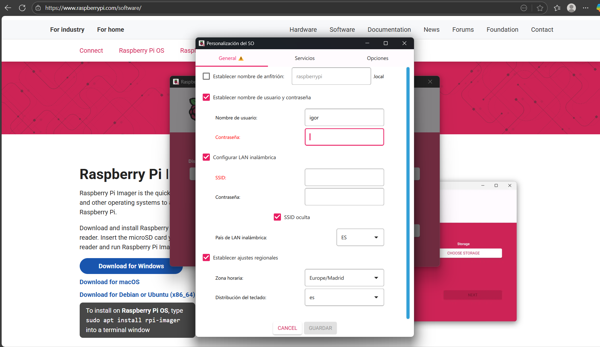
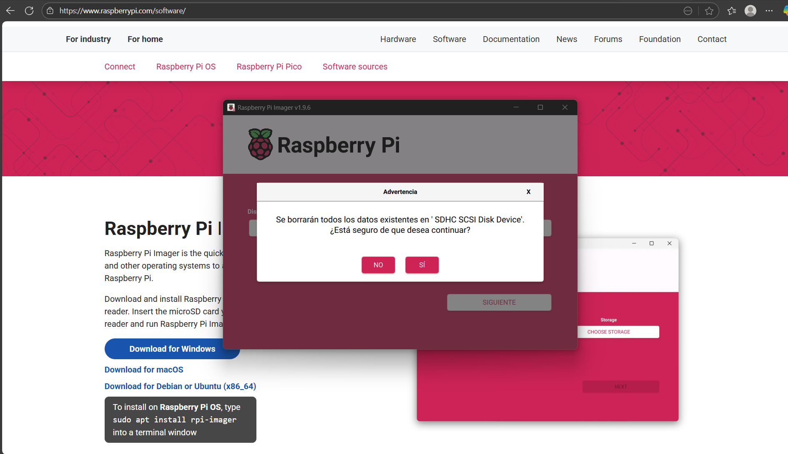
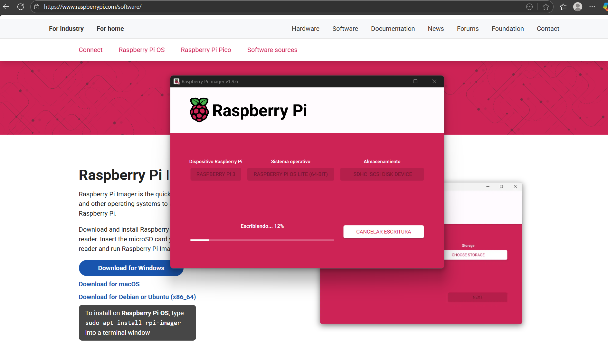
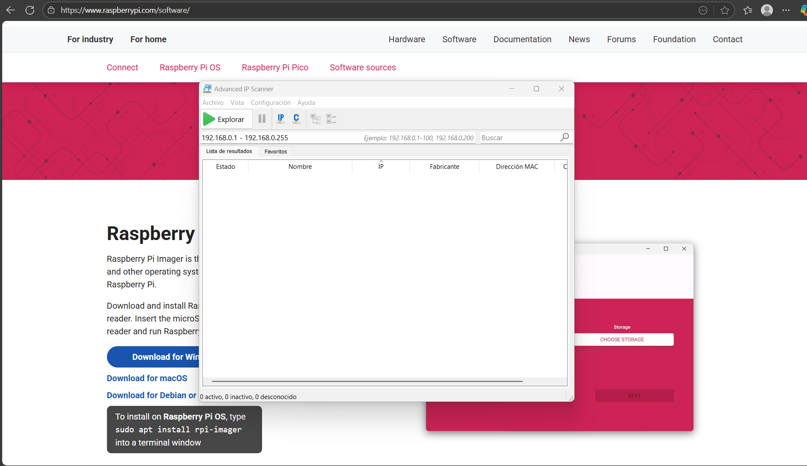
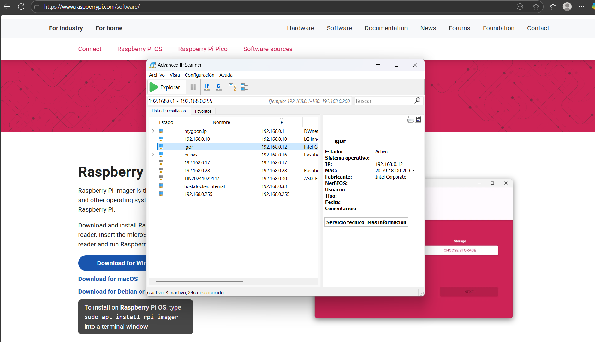
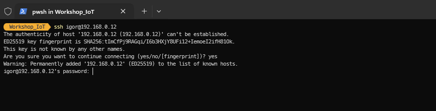

## Content

1. Introduction / Welcome
2. Theory part
   - 1. What is IoT and brief history
   - 2. IoT concepts
   - 3. Devices
   - 4. Communication protocols
   - 5. Architecture
3. Practical part
   - 1. Setup
   - 2. Circuit board
   - 3. Architecture

**Note:**
CP210x_Universal_Windows_Driver in order to achieve the programming of PlatformIO with ESP32

## Raspberry Pi

### Setup Raspberry Pi OS

1. Install the Raspberry Pi Imager

```
https://www.raspberrypi.com/software/
```

2. Start the application

3. Choose device type in the first option

```
Raspberry Pi 3
```


4. Choose the SO type

```
Raspberry Pi OS (other) > Raspberry Pi OS Lite (64-bit) With NO desktop environment
```





5. Choose the device storage



6. Click on **Next**

7. Before flashing the OS to the Raspberry Pi board, we need to setup some configurations. Click on **Edit Settings**



8. Edit the information in the **General** block

**Username and Password**

```
username: igor
password: igor
```

**LAN configuration**

```
SSID: XXXXX
Password: YYYYY
```



9. Edit the information in the **Services** block

Use password auth


10. Click on YES

11. Click YES on the warning panel to override the previous data



12. Start the writting process




### Start Raspberry Pi

1. Insert the microSD inside the Raspberry Pi board and plug the device

2. Open the **Advanced IP Scanner**



3. Start the search to find the Raspberry Pi board IP



4. Access the board by opening a terminal and run the **ssh** command

```
ssh igor@192.168.0.17
```


5. Type YES and insert the password




### Setup Broker

1. Install mosquitto broker

```
sudo apt update && sudo apt upgrade
```

```
sudo apt install -y mosquitto mosquitto-clients
```

2. Make sure the mosquitto starts at raspberry pi boot

```
sudo systemctl enable mosquitto.service
```

3. Check mosquitto installed version

```
mosquitto -v
```

4. Enable remote communications, we need to edit the configuration file. Remote Access (No auth)

```
sudo nano /etc/mosquitto/mosquitto.conf
```

5. Paste 2 lines at the end of the file

```´
listener 1883
allow_anonymous true
```

6. In order the changes to take effect execute the restart of the service

```
sudo systemctl restart mosquitto
```

```
sudo systemctl status mosquitto
```

### Start Broker

1. Get the local Raspberry Pi IP

```
hostname -I
```

2. Test the mosquitto fresh install broker. Run mosquitto broker in the background

```
mosquitto -d
```

3. Subscribe to a specific topic to start receiving the data

```
mosquitto_sub -d -t testTopic
```

4. Publish data to the topic

```
mosquitto_pub -d -t testTopic -m "Hello world!"
```

## Install Node-Red

1. Install Node-Red tool to manage the incoming MQTT communications

```
bash <(curl -sL https://raw.githubusercontent.com/node-red/linux-installers/master/deb/update-nodejs-and-nodered)
```

By default Node-Red is installed in Raspberry Pi OS however its recommencded to run the previous command to update to the newest versions

2. Once its installed run the command to configure the tool

```
node-red admin init
```

3. Press Enter to create a Node-RED Settings file on /home/pi/.node-red/settings.js

```
Do you want to set up user security? Yes.
Enter a username and press Enter (you need to remember it later).
Enter a password and press Enter (you need to remember it later).
Then, you need to define user permissions. We’ll set full access, make sure the full access option is highlighted in blue and press Enter.
You can add other users with different permissions if you want. We’ll just create one user for now. You can always add other users later.
Do you want to enable the Projects feature? No.
Enter a name for your flows file. Press Enter to select the default name flows.json.
Provide a passphrase to encrypt your credentials file.
Learn more about what is a passphrase.
Select a theme for the editor. Simply press Enter to select default.
Press Enter again to select the default text editor.
Allow Function nodes to load external modules? Yes.
Node-RED configuration was successful. All settings are saved on settings.js.
```

4. After all the configurations are done we can start the node-red tool

```
node-red-start
```

5. To run node-red on boot run the following:

```
sudo systemctl enable nodered.service
```

6. After the instalation you can acces the interface on the http://raspberryPiIP:1880/ui

**NOTE:** Install new palette dashboard: Go to **Manage palette** > **Install** section and search for **node-red-dashboard**
