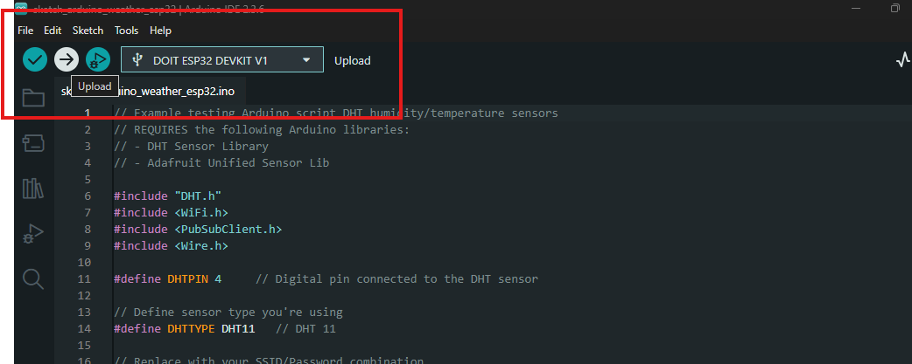

# Weather Station - Table of Contents

## Project Overview

- [Weather Station Introduction](#weather-station)

## Hardware Setup

- [Requirements](#requirements)
  - [ESP32 Setup](#esp32)
  - [DHT11 Sensor](#dht11)
  - [Sensor Pinout](#sensor-pinout)
- [Connection Schema](#connection-schema)

## Software Configuration

- [Install Arduino Libraries](#install-the-arduino-libraries-to-use-the-sensors)
- [ESP32 Code Implementation](#code)
  - [Library Includes](#code)
  - [Pin and Sensor Definitions](#code)
  - [WiFi and MQTT Configuration](#code)
  - [Main Functions Setup](#code)
  - [MQTT Callback Functions](#code)
  - [Main Loop Implementation](#code)

## Testing and Deployment

- [MQTT Workflow](#workflow-mqtt-pubsub-messages)
- [Dashboard Setup](#dashboard-panel)

---

# Weather station

Project to build a weather station using the **ESP32** devkit board and the **DHT11** temperature and humidity sensor.

## Requirements

### ESP32

Check the README.md from the root project folder in order to set up the ESP32 device board requirements.

### DHT11

These sensors contain a chip that does analog to digital conversion and spit out a digital signal with the temperature and humidity. This makes them very easy to use with any microcontroller.

#### Sensor PINOUT


## Connection schema


## Install the Arduino Libraries to use the sensors

1. Go to **Sketch** > **Include Library** > **Manage Libraries**

2. Type **DHT sensor library**


3. Install the next library, type in the same search box **Adafruit Unified Sensor**


4. Install the **pubsubclient** library by downloading the .zip folder

```
https://github.com/knolleary/pubsubclient/archive/master.zip
```

5. Rename the downloaded folder from **pubsubclient-master** to **pubsubclient**

6. Go to **Sketch** > **Include Library** > **Add .zip library**

7. Restart the Arduino IDE

## Code

1. Include the installed libraries

```arduino
#include "DHT.h"
#include <WiFi.h>
#include <PubSubClient.h>
#include <Wire.h>
```

2. Define the ESP32 pin attached to the DHT11 sensor output

```arduino
#define DHTPIN 4
```

3. Define the sensor type

```arduino
#define DHTTYPE DHT11
```

4. Define your WiFi credentials

```arduino
const char* ssid = "";
const char* password = "";
```

5. Add your MQTT Broker IP server address

```arduino
const char* mqtt_server = "192.168.0.18";
```

6. Define the led ESP32 pinout

```arduino
const int ledErrorPin = 15;
const int ledWarningPin = 5;
const int ledOperationalPin = 18
```

7. Define the variable to use

```arduino
WiFiClient espClient;
PubSubClient client(espClient);
long lastMsg = 0;
char msg[50];
int value = 0;
float temperature = 0;
float humidity = 0;
```

8. Init the DHT sensor library with the defined pin and the sensor type

```arduino
DHT dht(DHTPIN, DHTTYPE);
```

9. Define the setup() function

```arduino
void setup() {
  Serial.begin(115200);
  Serial.println(F("Init DHT11 sensor reading script..."));
  setup_wifi();
  client.setServer(mqtt_server, 1883);
  client.setCallback(callback);

  pinMode(ledErrorPin, OUTPUT);
  pinMode(ledWarningPin, OUTPUT);
  pinMode(ledOperationalPin, OUTPUT);
  dht.begin();
}
```

10. Define the function to connect to the WiFi network

```arduino
void setup_wifi() {
  delay(10);
  // We start by connecting to a WiFi network
  Serial.println();
  Serial.print(".........");
  Serial.print("Connecting to ");
  Serial.println(ssid);
  Serial.print(".........");

  WiFi.begin(ssid, password);

  while (WiFi.status() != WL_CONNECTED) {
    delay(500);
    Serial.print(".");
  }

  Serial.println("");
  Serial.println("WiFi connected");
  Serial.println("IP address: ");
  Serial.println(WiFi.localIP());
}
```

11. Define the callback function to subscribe to the MQTT topics and perform an action

```arduino
void callback(char* topic, byte* message, unsigned int length) {
  Serial.print("Message arrived on topic: ");
  Serial.print(topic);
  Serial.print(". Message: ");
  String messageTemp;

  for (int i = 0; i < length; i++) {
    Serial.print((char)message[i]);
    messageTemp += (char)message[i];
  }
  Serial.println();
  if (String(topic) == "esp32/redled") {
    Serial.print("Changing output to ");
    if(messageTemp == "on"){
      Serial.println("on");
      digitalWrite(ledErrorPin, HIGH);
    }
    else if(messageTemp == "off"){
      Serial.println("off");
      digitalWrite(ledErrorPin, LOW);
    }
  }
    if (String(topic) == "esp32/blueled") {
    Serial.print("Changing output to ");
    if(messageTemp == "on"){
      Serial.println("on");
      digitalWrite(ledWarningPin, HIGH);
    }
    else if(messageTemp == "off"){
      Serial.println("off");
      digitalWrite(ledWarningPin, LOW);
    }
  }
  if (String(topic) == "esp32/greenled") {
    Serial.print("Changing output to ");
    if(messageTemp == "on"){
      Serial.println("on");
      digitalWrite(ledOperationalPin, HIGH);
    }
    else if(messageTemp == "off"){
      Serial.println("off");
      digitalWrite(ledOperationalPin, LOW);
    }
  }
}
```

12. Define the reconnect() function to try again to connect to the MQTT topic

```arduino
void reconnect() {
  // Loop until we're reconnected
  while (!client.connected()) {
    Serial.print("Attempting MQTT connection...");
    // Attempt to connect
    if (client.connect("ESP32Client")) {
      Serial.println("connected");
      // Subscribe
      client.subscribe("esp32/redled");
      client.subscribe("esp32/blueled");
    } else {
      Serial.print("failed, rc=");
      Serial.print(client.state());
      Serial.println(" try again in 5 seconds");
      // Wait 5 seconds before retrying
      delay(5000);
    }
  }
}
```

13. Finally define the loop() function that the ESP32 device board will perform

```arduino
void loop() {
  if (!client.connected()) {
    reconnect();
  }
  client.loop();
  long now = millis();
  if (now - lastMsg > 5000) {
    lastMsg = now;
    // Reading temperature or humidity takes about 250 milliseconds
    humidity = dht.readHumidity();
    // Read temperature as Celsius (the default)
    temperature = dht.readTemperature();
    // Check if any reads failed and exit early
    if (isnan(humidity) || isnan(temperature)) {
      Serial.println(F("Failed to read from DHT sensor!"));
      return;
    }
    float hic = dht.computeHeatIndex(temperature, humidity, false);
    Serial.print(F("Humidity: "));
    Serial.print(humidity);
    Serial.print(F("%  Temperature: "));
    Serial.print(temperature);
    Serial.print(F("°C "));
    Serial.print(hic);
    Serial.print(F("°C "));
    // Convert the value to a char array
    char tempString[8];
    dtostrf(temperature, 1, 2, tempString);
    Serial.print("Temperature: ");
    Serial.println(tempString);
    client.publish("esp32/temperature", tempString);
    // Convert the value to a char array
    char humString[8];
    dtostrf(humidity, 1, 2, humString);
    Serial.print("Humidity: ");
    Serial.println(humString);
    client.publish("esp32/humidity", humString);
  }
}
```

14. Upload the Code to the board



## Workflow MQTT pub/sub messages


## Dashboard panel

1. Open a new browser tab and type

```
http://raspberryPiIP:1880
```

2. Go to **Menu** > **Manage palette** > **Install tab** > Type **dashboard** and install the dashboard modal


Go to **Menu** > **Import** > **Clipboard** and copy and paste the json from the NodeRedFlow.json

This should import the node-red box workflow

Click on **Deploy** button to deploy the flow


Open a new browser tab and type

```
http://raspberrypiIP:1880/dashboard/page1
```


