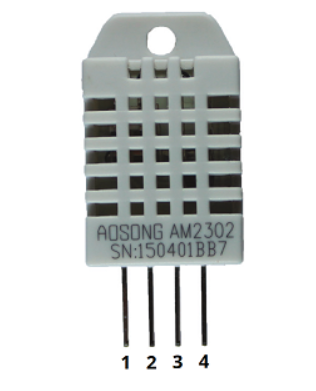
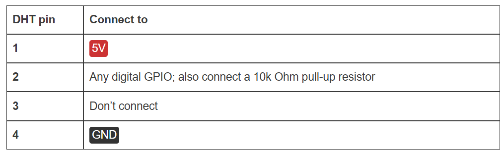
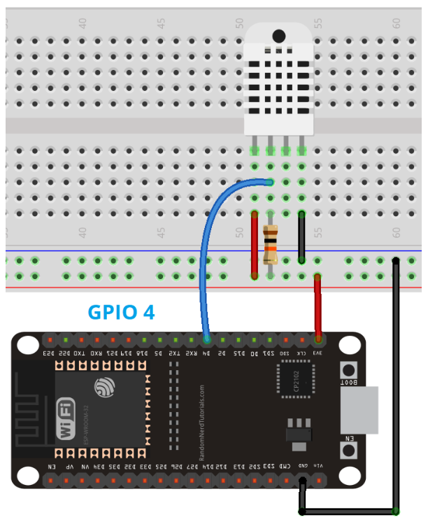
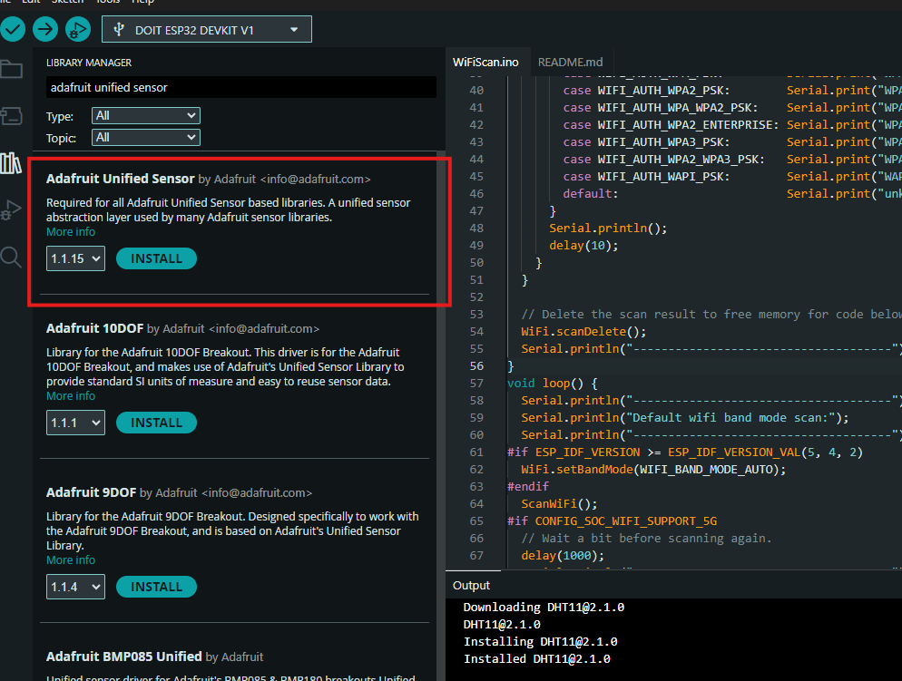
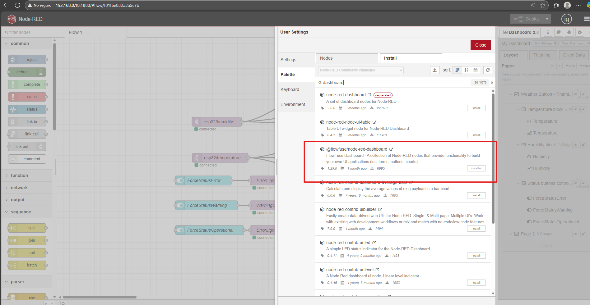
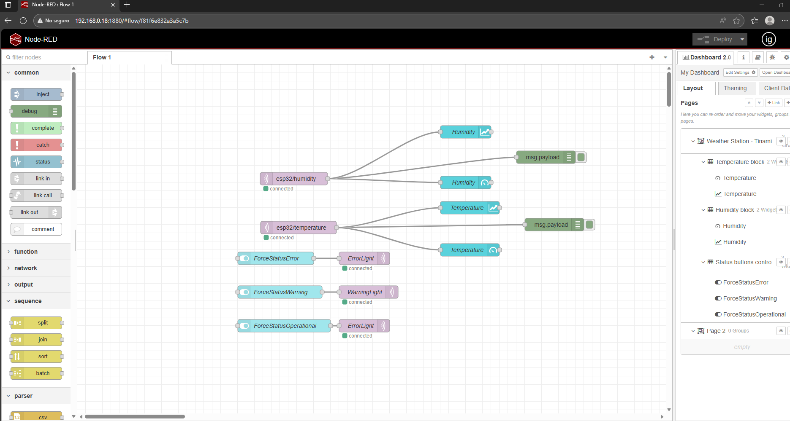
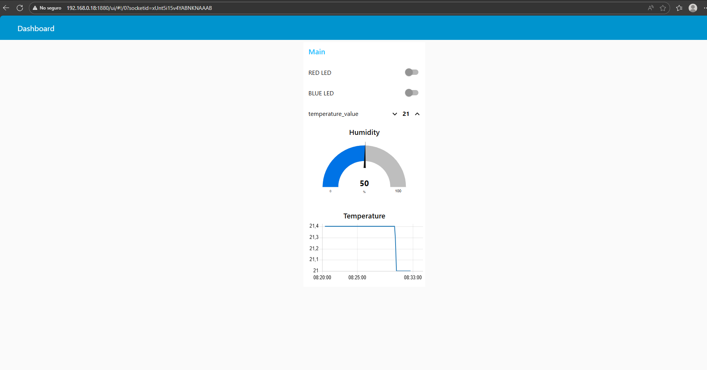

# Weather station

Project to build a weather station using the **ESP32** devkit board and the **DHT11** temperature and humidity sensor.

## Requirements

### ESP32

Check the README.md from the root project folder in order to set up the ESP32 device board requirements.

### DHT11

These sensors contain a chip that does analog to digital conversion and spit out a digital signal with the temperature and humidity. This makes them very easy to use with any microcontroller.

#### Sensor PINOUT





## Connection schema



## Install the Arduino Libraries to use the sensors

1. Go to **Sketch** > **Include Library** > **Manage Libraries**

2. Type **DHT sensor library**


3. Install the next library, type in the same search box **Adafruit Unified Sensor**



4. Install the **pubsubclient** library by downloading the .zip folder

```
https://github.com/knolleary/pubsubclient/archive/master.zip
```

5. Rename the downloaded folder from **pubsubclient-master** to **pubsubclient**

6. Go to **Sketch** > **Include Library** > **Add .zip library**

7. Restart the Arduino IDE

## Code

1. Include the installed libraries

```arduino
#include "DHT.h"
#include <WiFi.h>
#include <PubSubClient.h>
#include <Wire.h>
```

## Workflow MQTT pub/sub messages


## Dashboard panel

1. Open a new browser tab and type

```
http://raspberryPiIP:1880
```

2. Go to **Menu** > **Manage palette** > **Install tab** > Type **dashboard** and install the dashboard modal



Go to **Menu** > **Import** > **Clipboard** and copy and paste the json from the NodeRedFlow.json

This should import the node-red box workflow

Click on **Deploy** button to deploy the flow



Open a new browser tab and type

```
http://raspberrypiIP:1880/dashboard/page1
```


